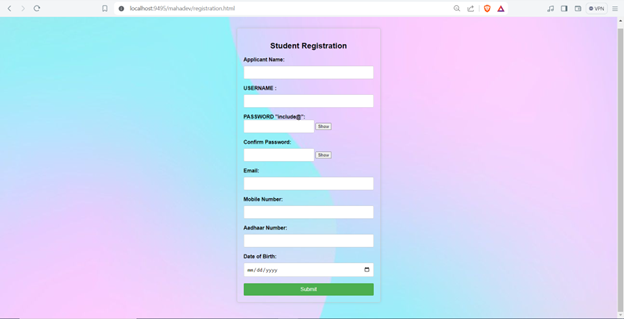
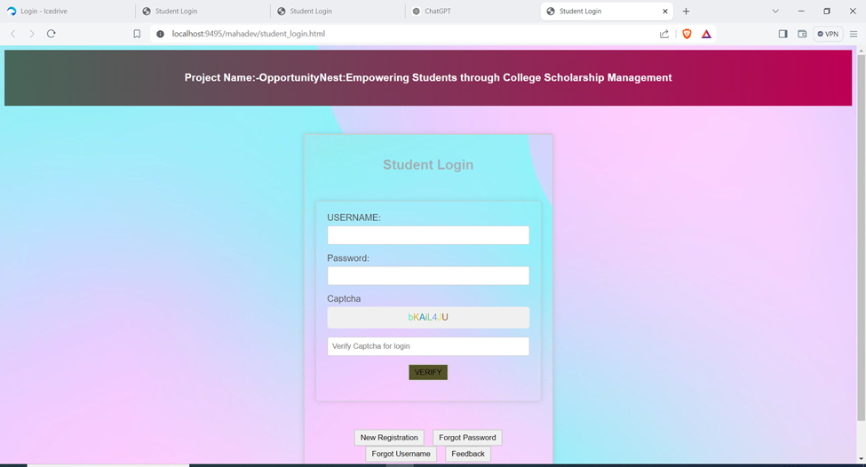
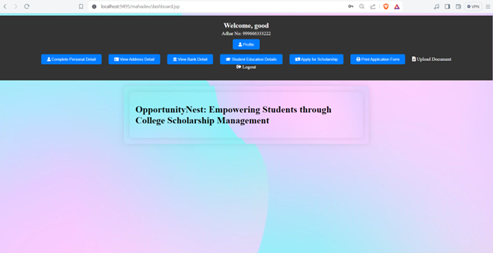
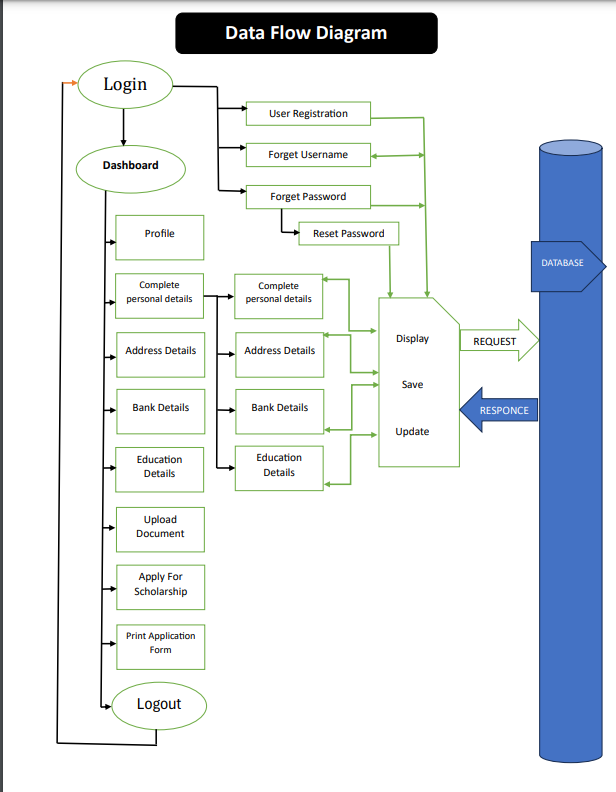
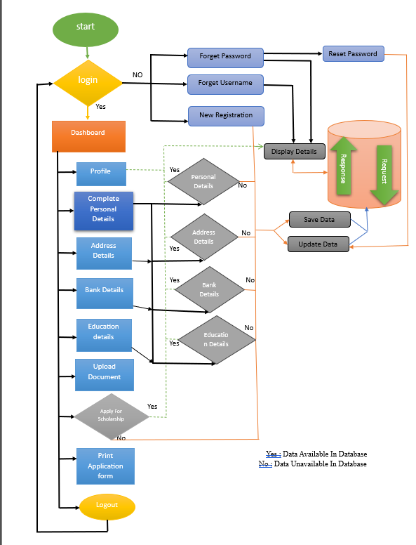

# College Scholarship Management System

## Table of Contents
1. [Project Overview](#project-overview)
2. [Introduction](#introduction)
3. [Technologies Used](#technologies-used)
4. [Features](#features)
5. [Installation](#installation)
6. [Screenshots](#screenshots)
7. [Usage](#usage)
8. [License](#license)
9. [Acknowledgments](#acknowledgments)

## Screenshot

## Screenshot

## Screenshot

## Screenshot

## Screenshot

## Project Overview
**Opportunity Nest** is a comprehensive platform designed to assist students in finding, applying for, and managing college scholarships. This system automates scholarship matching based on student profiles and academic achievements, streamlining the application process.

## Introduction
Opportunity Nest: Empowering Students through College Scholarship Management is a groundbreaking project aimed at revolutionizing how college students navigate and access scholarship opportunities. Our initiative seeks to simplify the often daunting process of finding, applying for, and managing scholarships, making it more accessible for students from diverse backgrounds to pursue their educational goals. 

By leveraging cutting-edge technology and user-centric design principles, Opportunity Nest serves as a centralized hub where students can discover, apply for, and track scholarships seamlessly.

Built with HTML, CSS, and JavaScript on the frontend and powered by Java servlets and JSP on the backend, Opportunity Nest ensures a seamless and intuitive user experience. MySQL serves as the backbone for efficient database management, enabling the smooth storage and retrieval of user data and scholarship information.

## Technologies Used
- **Frontend**: HTML, CSS, JavaScript
- **Backend**: Java, JSP, Servlets
- **Database**: MySQL
- **Other Languages**: SQL, XML
- **Server**: Apache Tomcat

## Features
- **User-Friendly Interface**: Designed specifically for college students, making navigation easy and intuitive.
- **Personalized Recommendations**: Helps students identify scholarships that align with their academic interests and qualifications.
- **Real-Time Application Tracking**: Allows students to monitor the status of their applications and deadlines.
- **Resource Center**: Provides guides, tips, and tools for crafting compelling scholarship applications.
- **Interactive Forums**: Facilitates a vibrant community for advice and experience sharing.

## Installation
To run this project locally, follow these steps:

### Prerequisites
- **Apache Tomcat**: Download and install Apache Tomcat, ensuring it's properly set up.
- **MySQL**: Install MySQL and set up a database with `root` user and `root` password.
- **Java Development Kit (JDK)**: Download and set up the JDK (Java Development Kit). Ensure `JAVA_HOME` is set in environment variables.
- **JDBC Driver**: Download and configure the MySQL JDBC driver.
- **Eclipse IDE**: Use Eclipse IDE to open and run the project.

### Setup Apache Tomcat
1. **Download Apache Tomcat**: Download the latest version of Apache Tomcat from [Tomcat's official website](https://tomcat.apache.org/).
2. **Install Apache Tomcat**: Unzip the downloaded file and configure `CATALINA_HOME` in your environment variables.
3. **Set Up Server in Eclipse**: In Eclipse, go to `Window` > `Preferences` > `Server` > `Runtime Environments` and add your Apache Tomcat installation.

### Setup MySQL Database
1. **Install MySQL**: Download MySQL from [MySQL's official website](https://www.mysql.com/).
2. **Create Database**:
